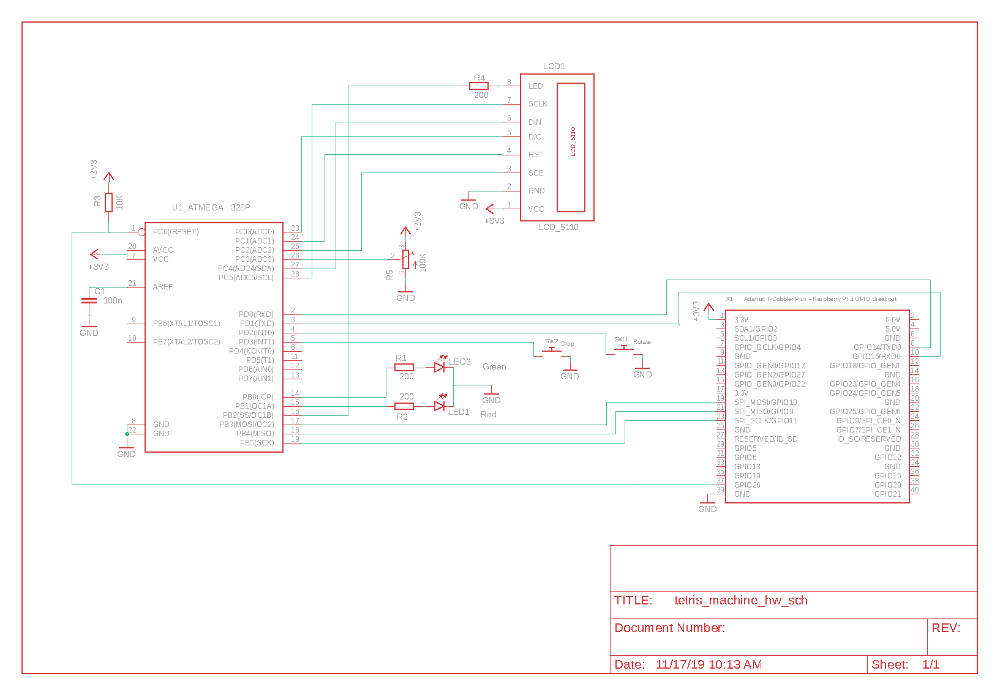

# ToRT - Toy-grade OSEK/VXD-inspired RTOS

## Overview

This project started out with the intention to implement a simple RTOS
based on OSEK/VXD for the ATmega328P to be run in a simulator. It ended
up with a hardware device being able to play Tetris: The "**Tetris Machine**".
An RTOS was also implemented, although very different from what was
originally intended :)

On the hardware side the project consists of a device based on the ATmega328P
microcontroller (which is also powering Arduino Uno boards), a monochrome
LCD display, a couple of LEDs, buttons and a potentiometer.
The hardware was put together on a breadboard and is doomed to exist only until
I need some of its components for other projects. It is trivial to build,
even with minimal electronics knowledge.

The software stack is constructed as three layers: Microcontroller,
operating system and application. The latter uses the services of the OS
layer to implement a Tetris clone as a set of distinct tasks that realize
functionality according to the MVC pattern (roughly).

Beware:
"Toy-grade" must not be mistaken to mean "fit for usage in children's toys",
as the current use case of running a Tetris implementation may insinuate,
it rather means the OS _**is**_ a toy: Incomplete, bug ridden and good only for
playing around with a homebrew OS.

## Motivation

- Have something creative/constructive to do when bored. I started this
project and worked on it from time to time for my own entertainment while
enjoying a longer professional timeout.

- Gather hands-on experience with the actual implementation of an RTOS.
While I have worked with other RTOS, it was always only as a user.

- Reuse it in other projects. I currently have another project (corecos) ongoing
that implements a SoC to mimic a C64 style computer using modern hardware.
The OS will need to be updated for this to be able to handle multiple
concurrent tasks at the same priority level (time sharing) among other "details".

- Next to last but not least: I have a thing for old computers and old games
(C64 and NES fans around?) and Tetris is one of the oldest games.
So I just needed to eventually implement my own version of it -
on an 8-bit machine, of course!

- And most important: Soil the RTOS landscape with yet another
implementation that no one needs or wants :)

## Hardware



The "Tetris Machine" is a simple device consisting of:

```
1 x Atmel (Microchip) ATmega328P microcontroller - PDIP package
1 x Sparkfun Graphic LCD 84x48 - Nokia 5110
1 x 100K ohm potentiometer
1 x red LED
1 x green LED
1 x 100n farad capacitor
3 x 200 ohm resistor
1 x 10K ohm resistor
2 x push button
```

The value of the resistors is not critical, you can use anything reasonable you
have at hand. High values will reduce LEDs brightness too much, a too low value
for the pull up resistor on the reset line could cause the Raspberry to not be
able to pull the reset line low anymore (flashing the microcontroller will no
longer work in this case). The ubiquitous 1/4 W, 5% tolerance resistors are fine.

Optional:

- Breadboard and jumper wires

As for the jumper wires: I haven not counted how many wires are needed but my
wiring pretty much resembles a bird's nest. I'm sure you can do better.

- Raspberry Pi 3 Model B+ (my setup, but any version should do)

- Adafruit Pi T-Cobbler Plus - Breakout + Cable for Raspberry Pi.

Please note that although the Raspberry Pi and the breadboard are optional this
project assumes that they are used. If you wish to use something different you
will have to come up with your own hardware setup and also a method to flash the
firmware to the microcontroller.

In case you choose to use a Raspberry Pi (Highly recommended as you get for very
little money a quite capable development machine that can run the avr-gcc
compiler and do a lot of other useful things. Also very interesting if you only
have a Windows system but wish to play around with an inexpensive Linux system)
enable the SPI and UART interfaces on the Raspberry Pi using raspi-config.

Make sure the fuse bytes {Low: 0xE2, High: 0xDD, Extended: 0xFF} on the
microcontroller were written to the proper values (you only need to do this once
per project unless you change the configuration fuse bits) before you write the
actual firmware for the first time to the microcontroller.

The main Makefile contains a target to write the fuse bytes to the values needed
by this project using avrdude.

## Operating System

Really small implementation - the OS proper implementation is just a few hundred
lines of C code (without comments and blanks). Given that little amount of code I
will not go into too much details.

Some general information:

- Inspired by OSEK/VXD and at first aimed at an ECC1 conformance class compatible
implementation. Abandoned that in favor of a "enough for what I need right now"
approach.

- Static OS. The system is fully defined at build time. At runtime no allocation
of whatever kind of resources or creation of tasks takes place.

- Real-time capable. Guaranteed reaction to events with upper bounded reaction
time.

- Fully preemptive scheduling only. Cooperative scheduling is not supported.
Non-preemptible tasks or mixed scheduling can be simulated.

- Interrupts have higher priority than any task.
Interrupts on the ATmega328P also have different priorities but they are not
considered. Interrupt nesting is not supported

- Interrupts do **context saving**. So you can do (almost) anything you could do
from normal task context too. Take into account the **stack space** used by the
interrupt and add it to each task's stack that could be interrupted by that interrupt.
As a general rule: Keep interrupts as short as possible and defer processing
to a task where possible (like top halves and bottom halves in the Linux kernel).

- Event driven. Tasks run strictly based on priorities after being triggered
by events. Each task has its own unique priority. Always the highest priority
task that has no blocked resources and that is not in waiting state runs.

- Time sharing (concurrent execution of multiple tasks at the same priority level)
is not yet supported. Initial support exists but is not used: Timer periodically
invokes the scheduler, although nothing happens then except runtime is
wasted due to context saving and restoring.

- Supports "resources" to manage concurrency (think of them as mutexes)
Avoids priority inversion by implementing a variation of the OSEK priority
ceiling protocol.

- Supports events as a method of synchronization between tasks.
Events are owned by tasks. Everyone can set them but only the owner may wait on
them or clear them.

- Supports application timers. Default resolution is ~4 ms.
**Attention**: When using the ATmega328P internal oscillator you should
be aware that its tolerance is 10%. Forget anything that requires precise
timing. The microcontroller can be calibrated to reach a 1% precision which
is not quite trivial to do - see the data sheet.

- Pure 8-bit implementation. Everything is 8-bit wide except pointers.

- No support for multicore / SMP

- Contrary to OSEK this OS has no "suspended" state and therefore no API for
activating, terminating or chaining tasks. All task are activated at startup
and do never "stop". They will be in "waiting" state when they needs whatever
resources or await triggering by an event.

- Limitations:
256 tasks per system
256 application timers per system
8 resources per system
8 events per task

## Application

As an operating system alone is not very useful, an application was needed to
showcase the usage of the OS.

I know, Tetris is not exactly the type of application that calls for hard real-time
capabilities but I had no better idea and wanted to do a Tetris implementation
anyway.

To justify the usage of an RTOS let's just assume all hell will break loose
(fits of fury, nervous breakdown) if the internal state of the game and consequently
its representation on the LCD display are not **guaranteed** to be updated within
a defined time after a user interacts with the game controls :)

I will not go into details about Tetris - you can find that information in other
places - but only give the needed details used in this implementation to
ease understanding.

The game consists of a board and pieces which are called tetrominoes.
Both of them are composed of squares.

The key to understanding the implementation is that each square in the game is
represented by exactly one bit.

Therefore a line on the board is an 8-bit value, and the whole board is an array
of 16 8-bit values as detailed below.

#### Board

The board is a made of 8 x 16 squares. The normal format is 10 x 20, but I chose
the smaller format to account for the limited resources (small monochrome LCD
display and 8-bit microcontroller).

```
  Columns
     X

 76543210|
0        |
1        |
2   #    |
3  ###   |
4        |
5        |   R
6        | Y o
7        |   w
8        |   s
9        |
A        |
B        |
C       #|
D ####  #|
E### ## #|
F  ###  #|
----------
```

This translates to the binary values:

```
Board[0x0] = 0b00000000;
Board[0x1] = 0b00000000;
Board[0x2] = 0b00010000;
Board[0x3] = 0b00111000;
Board[0x4] = 0b00000000;
...
Board[0xB] = 0b00000000;
Board[0xC] = 0b00000001;
Board[0xD] = 0b01111001;
Board[0xE] = 0b11101101;
Board[0xF] = 0b00111001;
```

Which can be written more compact as:

uint8_t Board[] = {0,0,0x10,0x38,0,0,0,0,0,0,0,0x01,0x79,0xED,0x39};

#### Tetrominoes

A tetromino is composed of 4 orthogonally connected squares.

Tetrominoes are of seven different types:

```
Type 0    Type 1    Type 2    Type 3   Type 4   Type 5   Type 6

#         ##          #        ##               ##        #
###        ##       ###       ##       ####     ##       ###
```

Each of which can be in one of four different orientations:

Example for type 0:

```
Up        Right     Down      Left

          ##                   #
#         #         ###        #
###       #           #       ##
```

As can be seen, each tetromino fits into a 4 x 4 square (think of it as a bit map)
which, represented as bits equals 16 bits or two bytes.

```
0000
0001    #
0001    #
0011   ##
```

If we translate that square into two bytes

```
0000   Byte 1 upper nibble (B1UN)
0001   Byte 1 lower nibble (B1LN)
0001   Byte 2 upper nibble (B2UN)
0011   Byte 2 lower nibble (B2LN)
```

We obtain

```
B1UN B1LN -> 0000 0001 -> 0x01
B2UN B2LN -> 0001 0011 -> 0x13
```

So the encoding of the bitmap for the tetromino of "type 0" in orientation "left"
is {0x01, 0x13}

Using the encoding method described above all seven types of tetrominoes in all
four orientations are encoded and stored into an array only consuming 56 bytes,
which is tolerable even for a small microcontroller. This way rotation
of a tetromino boils down to a simple table lookup and does not imply any maths.

The table where the tetromino bitmaps are stored:

```
static const uint8_t Tetrominoes[][][] = {
         {{0x00, 0x47}, {0x03, 0x22}, {0x00,0x71}, {0x01, 0x13}}
	...
}
```

The first line (tetromino type 0, in orientations up, right, down and left)
decodes as follows:

```
{0x00, 0x47} -> 00000000 01000111

0000
0000
0100      #
0111      ###

{0x03, 0x22} -> 00000011 00100010

0000
0011      ##
0010      #
0010      #

{0x00, 0x71} -> 00000000 01110001

0000
0000
0111      ###
0001        #

{0x01, 0x13} -> 00000001 00010011

0000
0001       #
0001       #
0011      ##

```

As both the board and the tetrominoes are represented as bit fields, collision
detection resumes to comparing the lines of the square of the tetromino with
the lines on the board that it is currently on or tries to occupy next and
checking if there are two set bits that overlap by performing a "bitwise and"
operation on the relevant bits.

The implementation is broken down into three different tasks, according to the
MVC pattern. The Controller Task handles user input (two buttons to control
orientation and falling speed and a potentiometer to control the location on the
X-axis), the Model Task keeps the internal state of the game i.e. state of
the board and of the currently falling tetromino (type, orientation, speed and
position) and triggers the View Task which translates the state of the game
into a bitmap which is then displayed on the LCD display.

## Playground

To be able to experiment without having to flash the microcontroller (a rather
lengthy process) each time you do a change, a minimalist application and build
environment in provided in the playground directory that uses the avr simulator
and has the significant additional benefit that you can debug using the avr-gdb.

## Emulator

To make my life easier I also implemented an emulator for the system that uses
POSIX threads, mutexes and condition variables to mimic the tasks, resources
and events in the RTOS as well as the X11 system for the LCD display.
It is just way more comfortable to develop the algorithms and debug the graphics
in this environment than directly on the microcontroller.

## Demonstration Video

Take a look at the file "tetris_machine.mov" which shows the device in action.
Sorry for the quality. It clip was shot standing, without a tripod and having
the board on my kitchen table :)

## Todo

- Fix the bugs. I fixed those I knew of but I'm sure there are more.

- Add missing features to the OS as need for them comes up

- Maybe do double buffering for the LCD display?

I have another two ATtiny85 controllers laying around and I feel really tempted
to do a distributed system version with the ATmega328P managing the LCD and "business"
logic and the two tinies handling the buttons, the LEDs and the  potentiometer
and communicate with the mega over some bus - bitbanged CAN or something like that.

## Development environment

Developed under GNU/Linux - [Debian](https://www.debian.org/) (Desktop) and [Raspbian](https://www.raspberrypi.org/downloads/raspbian/) (Raspberry Pi)
distributions

Toolchain and other tools/utilities used:

Desktop

- avr-gcc
- simulavr
- avr-gdb

Raspberry Pi

- avr-gcc
- avrdude
- [gpio utility ](http://wiringpi.com/the-gpio-utility/)

## References

For those completely new to electronics I recommend reading [The Art of Electronics](https://www.amazon.com/Art-Electronics-Paul-Horowitz-dp-0521809266/dp/0521809266/ref=mt_hardcover?_encoding=UTF8&me=&qid=)

Helpful specifications and datasheets:

- OSEK/VDX Operating System v 2.2.3

- ATmega328P

- PCD8544 48 × 84 pixels matrix LCD


## Homepage And Source Code Repository

https://github.com/coronensis/tort

## Contact
Helmut Sipos <helmut.sipos@gmail.com>
